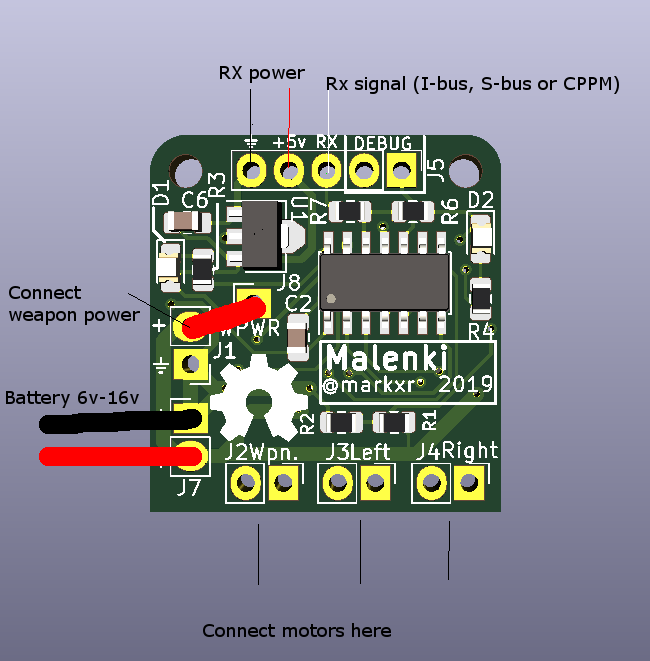

Malenki-ESC user documentation
======

Introduction
------

Malenki-ESC is a 3-channel DC brushed motor controller designed for small combat
robots or other models with skid-steering and one other channel.

This is the end-user documentation and is meant to explain how to use the ESC in 
your robot.

Description of the board
--------
The bare board contains components on the front and back. Some of these have 
battery voltage on, so it must be protected from short circuit, for example, by
heat-shrink.

There are two mounting holes (at the time of writing) - these can take M2 bolts
but nylon (or other non-conductive) bolts are recommended to minimise the chance
of a short circuit.

Connectors
-----

All of the connectors are pin-through-hole for mechanical strength and use 2.54mm pitch.

J1 and J7 are duplicate input power connectors. They are connected together and both
contain a GND and battery positive voltage. It is recommended to connect a 
battery pack to J7, and use the positive pin of J1 to connect to the weapon power.

J8 is a single pad which is the positive weapon power terminal. You can connect
this using a short wire, to the positive terminal of J1 to run the weapon off
normal battery voltage.

J2, J3 and J4 are the output connectors for the DC motors weapon, left and right 
respectively. They are labelled on the board.

J5 is the receiver interface which provides power to the receiver (i.e. "BEC" battery elimination circuit)
and receives data.

Getting started
---------------

1. Connect your battery pack, or battery connector, to J7. Observe the correct polarity.
2. (Optional) solder a wire from the positive pin of J1 to J8 for weapon power
3. Connect motors to J2,J3,J4
4. Connect your receiver to J5 ping GND, +5 and RX

Note that there you can solder straight pin headers, right-angle pin headers, or
flying wires to J5.

Maximum ratings
---------------

Nothing should exceed 16 volts! The capacitors are only rated for 16v and using more
might explode them or short them and cause a fire.

Maximum recommended current per channel is 2A.

Maximum recommended current on the rx interface is 150mA

It is recommended to use a 2S lipo pack with nominal 7.4v. A 3S pack could also
be used carefully.

Using higher weapon voltage
---------------------------

It is possible to use a different (e.g. higher) voltage for the weapon channel. You can do this
by soldering a wire to J8 with a different voltage supply. This needs to be referenced to 
the common GND (of course) and must not exceed the maximum voltage. Possible options are:

* Add a 1S lithium cell between VBAT and J8, to increase the voltage (to 11.1 nominal)
* Use a voltage boost circuit to generate a higher voltage and feed into J8

Receiver interface
------------------

Malenki-ESC supports the following receiver formats:

* PPM aka cPPM - which is a "combined PPM" signal with successive channels PPM and a long sync pulse.
* Turnigy / Flysky "I-Bus" protocol
* S-BUS

It will automatically detect which protocol is in use, but will not change protocols unless restarted.

Only channels 1-6 are used.

Channels are as follows:

* 1 = Steering
* 2 = Weapon
* 3 = Throttle
* 4 = (unused)
* 5 = Invert option 
* 6 = Set config (see below)

Calibration
-----------

After the receiver is powered on, the ESC will be in calibration mode. Move the throttle (channel 3) 
to minimum, maximum, then back to the centre. 

Ensure that all switches are in their default position (off etc) during power-on.

Inverted operation
-----

Channel 5 will work as an invert switch - if this is switched while in running mode
then left & right are inverted and swapped.

Configuration
-----
The channels can be inverted by the following procedure:

1. With RX on, switch on the transmitter
2. Leave the throttle at minimum.
3. Set up a switch on auxilliary channel 6
4. Press the aux switch (on+off, or positive then negative) a number of times with less than 2 seconds between each press:

* 2 pushes = invert left channel
* 3 pushes = invert right channel
* 4 pushes = invert weapon channel
* 5 pushes = reset to defaults (nothing inverted)

LEDs
----
D1 (red in design) - this LED gives a pulse code to indicate error condition:

1 pulse = no signal
3 pulses = low battery
4 pulses = critical low battery (and the ESC will soon shut down)

low battery indication will only work if a 2S pack is detected.

D2 (blue in design) - this LED is on when there is a RX signal, and off otherwise.

